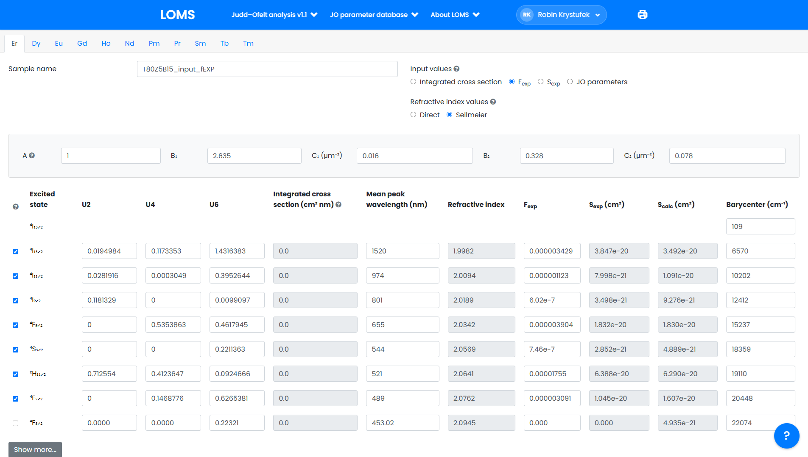
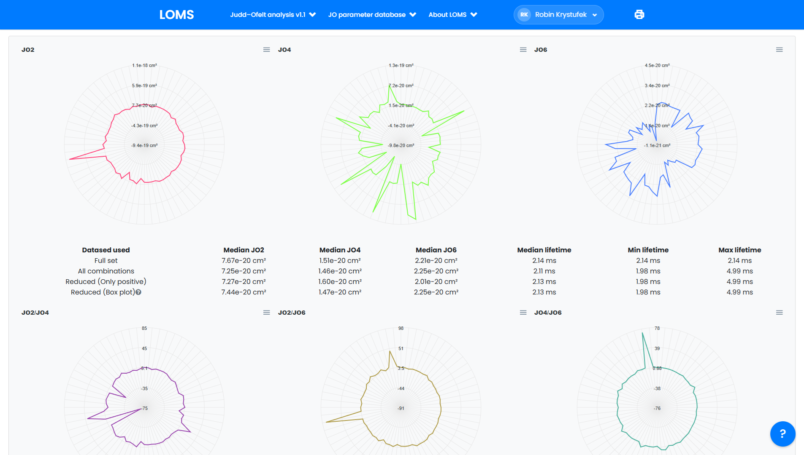
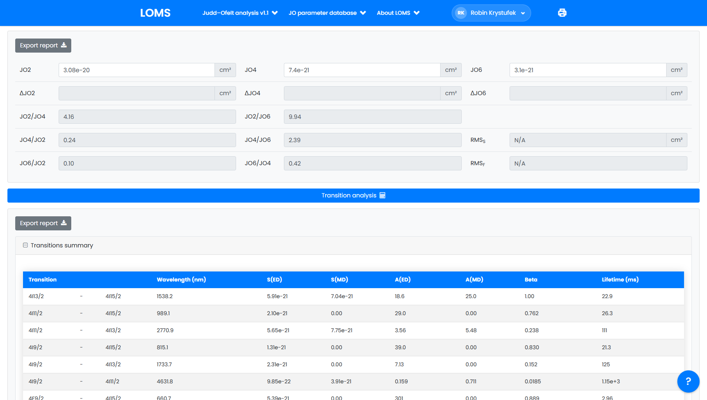

[![CC BY-NC-ND 4.0][cc-by-nc-nd-shield]][cc-by-nc-nd]

# [LOMS Judd–Ofelt analysis suite][LOMSJO]

This repository hosts the interactive online tool for performing Judd–Ofelt analysis, developed by J. Hrabovsky, P. Varak, and R. Krystufek. The tool facilitates both classical and combinatorial Judd–Ofelt analysis, helping researchers identify suitable rare-earth manifold combinations. The software is user-friendly with [comprehensive documentation][doc], [reference datasets][ref], and [troubleshooting guides][faq] available.

  <a href="https://www.loms.cz/jo/?RE=Er&sample_id=T80Z5B15_input_fEXP&input=%0Aref_index_type%2Csellmeier%2C%2C%2C%2C%2C%2C%0D%0Asellmeier_A%2C1%2C%2C%2C%2C%2C%2C%0D%0Asellmeier_B1%2C2.635%2C%2C%2C%2C%2C%2C%0D%0Asellmeier_C1%2C0.016%2C%2C%2C%2C%2C%2C%0D%0Asellmeier_B2%2C0.328%2C%2C%2C%2C%2C%2C%0D%0Asellmeier_C2%2C0.078%2C%2C%2C%2C%2C%2C%0D%0AData%20source%3A%20oscillator%20strength%20%28fexp%29%20for%20calculation%20of%20JO2%2C%20JO4%20and%20JO6%20parameters%20and%20radiative%20properties%20Hrabovsky%20%282024%29%2C%2C%2C%2C%2C%2C%0D%0Aexcited_state%2Cu2%2Cu4%2Cu6%2Cfexp%2Cmean_peak_wl_nm%2Crefractive_index%2Cbarycenter%0D%0A4I15%2F2%2C0%2C0%2C0%2C0%2C0%2C%2C109%0D%0A4I13%2F2%2C0.0194984%2C0.1173353%2C1.4316383%2C0.000003429%2C1520%2C%2C6570%0D%0A4I11%2F2%2C0.0281916%2C0.0003049%2C0.3952644%2C0.000001123%2C974%2C%2C10202%0D%0A4I9%2F2%2C0.1181329%2C0%2C0.0099097%2C0.000000602%2C801%2C%2C12412%0D%0A4F9%2F2%2C0%2C0.5353863%2C0.4617945%2C0.000003904%2C655%2C%2C15237%0D%0A4S3%2F2%2C0%2C0%2C0.2211363%2C0.000000746%2C544%2C%2C18359%0D%0A2H11%2F2%2C0.712554%2C0.4123647%2C0.0924666%2C0.00001755%2C521%2C%2C19110%0D%0A4F7%2F2%2C0%2C0.1468776%2C0.6265381%2C0.000003091%2C489%2C%2C20448%0D%0A4F5%2F2%2C0%2C0%2C0.2232101%2C0%2C453.0216544%2C%2C22074%0D%0A4F3%2F2%2C0%2C0%2C0.1272004%2C0%2C445.990545%2C%2C22422%0D%0A2H9%2F2%2C0%2C0.0189597%2C0.2255537%2C0%2C408.0799837%2C%2C24505%0D%0A4G11%2F2%2C0.918357%2C0.5260874%2C0.117176%2C0%2C377.4154589%2C%2C26496%0D%0A4G9%2F2%2C0%2C0.2415402%2C0.1234371%2C0%2C363.9275056%2C%2C27478%0D%0A2K15%2F2%2C0.0219741%2C0.004095%2C0.0757543%2C0%2C359.6992914%2C%2C27801%0D%0A2G7%2F2%2C0%2C0.0174109%2C0.1163147%2C0%2C357.4109153%2C%2C27979%0D%0A2P3%2F2%2C0%2C0%2C0.0172%2C0%2C315.9258206%2C%2C31653%0D%0A2K13%2F2%2C0.0032%2C0.0029%2C0.0152%2C0%2C302.2517757%2C%2C33085%0D%0A4G5%2F2%2C0%2C0%2C0.0026%2C0%2C299.4998353%2C%2C33389%0D%0A2P1%2F2%2C0%2C0%2C0%2C0%2C298.9268526%2C%2C33453%0D%0A4G7%2F2%2C0%2C0.0334%2C0.0029%2C0%2C293.9274587%2C%2C34022%0D%0A2D5%2F2%2C0%2C0%2C0.0228%2C0%2C287.3563218%2C%2C34800%0D%0A">
    
  </a>
  <a href="https://www.loms.cz/jo/?RE=Er&sample_id=T80Z5B15_input_fEXP&cjo=true&input=%0Aref_index_type%2Csellmeier%2C%2C%2C%2C%2C%2C%0D%0Asellmeier_A%2C1%2C%2C%2C%2C%2C%2C%0D%0Asellmeier_B1%2C2.635%2C%2C%2C%2C%2C%2C%0D%0Asellmeier_C1%2C0.016%2C%2C%2C%2C%2C%2C%0D%0Asellmeier_B2%2C0.328%2C%2C%2C%2C%2C%2C%0D%0Asellmeier_C2%2C0.078%2C%2C%2C%2C%2C%2C%0D%0AData%20source%3A%20oscillator%20strength%20%28fexp%29%20for%20calculation%20of%20JO2%2C%20JO4%20and%20JO6%20parameters%20and%20radiative%20properties%20Hrabovsky%20%282024%29%2C%2C%2C%2C%2C%2C%0D%0Aexcited_state%2Cu2%2Cu4%2Cu6%2Cfexp%2Cmean_peak_wl_nm%2Crefractive_index%2Cbarycenter%0D%0A4I15%2F2%2C0%2C0%2C0%2C0%2C0%2C%2C109%0D%0A4I13%2F2%2C0.0194984%2C0.1173353%2C1.4316383%2C0.000003429%2C1520%2C%2C6570%0D%0A4I11%2F2%2C0.0281916%2C0.0003049%2C0.3952644%2C0.000001123%2C974%2C%2C10202%0D%0A4I9%2F2%2C0.1181329%2C0%2C0.0099097%2C0.000000602%2C801%2C%2C12412%0D%0A4F9%2F2%2C0%2C0.5353863%2C0.4617945%2C0.000003904%2C655%2C%2C15237%0D%0A4S3%2F2%2C0%2C0%2C0.2211363%2C0.000000746%2C544%2C%2C18359%0D%0A2H11%2F2%2C0.712554%2C0.4123647%2C0.0924666%2C0.00001755%2C521%2C%2C19110%0D%0A4F7%2F2%2C0%2C0.1468776%2C0.6265381%2C0.000003091%2C489%2C%2C20448%0D%0A4F5%2F2%2C0%2C0%2C0.2232101%2C0%2C453.0216544%2C%2C22074%0D%0A4F3%2F2%2C0%2C0%2C0.1272004%2C0%2C445.990545%2C%2C22422%0D%0A2H9%2F2%2C0%2C0.0189597%2C0.2255537%2C0%2C408.0799837%2C%2C24505%0D%0A4G11%2F2%2C0.918357%2C0.5260874%2C0.117176%2C0%2C377.4154589%2C%2C26496%0D%0A4G9%2F2%2C0%2C0.2415402%2C0.1234371%2C0%2C363.9275056%2C%2C27478%0D%0A2K15%2F2%2C0.0219741%2C0.004095%2C0.0757543%2C0%2C359.6992914%2C%2C27801%0D%0A2G7%2F2%2C0%2C0.0174109%2C0.1163147%2C0%2C357.4109153%2C%2C27979%0D%0A2P3%2F2%2C0%2C0%2C0.0172%2C0%2C315.9258206%2C%2C31653%0D%0A2K13%2F2%2C0.0032%2C0.0029%2C0.0152%2C0%2C302.2517757%2C%2C33085%0D%0A4G5%2F2%2C0%2C0%2C0.0026%2C0%2C299.4998353%2C%2C33389%0D%0A2P1%2F2%2C0%2C0%2C0%2C0%2C298.9268526%2C%2C33453%0D%0A4G7%2F2%2C0%2C0.0334%2C0.0029%2C0%2C293.9274587%2C%2C34022%0D%0A2D5%2F2%2C0%2C0%2C0.0228%2C0%2C287.3563218%2C%2C34800%0D%0A">
    
  </a>
  

The database integrates tightly with the LOMS [Judd–Ofelt parameter database][db], enabling cross-validation of calculated results against published datasets.

## Features
- Classical and combinatorial Judd–Ofelt analysis
- Transitional analysis
- Step-by-step [user guide][doc]
- Reference [datasets][ref] and integration with [database of JO parameters][db] for data validation
- Front-end only JS+HTML design, ensuring data is processed locally without uploading requirements
- For more information, visit the LOMS [website][LOMSJO]

## Credits
LOMS Judd–Ofelt analysis suite was created by J. Hrabovsky, P. Varak, and R. Krystufek, and improved by a growing list of contributors.
Following libraries and their dependencies were used:
- ApexCharts.js https://github.com/apexcharts/apexcharts.js
- Formio.js https://github.com/formio/formio.js
- CookieConsent v3 https://github.com/orestbida/cookieconsent
- Firebase JavaScript SDK https://github.com/firebase/firebase-js-sdk
- Bootstrap v4 https://github.com/twbs/bootstrap
- Boxicons https://github.com/atisawd/boxicons

## License
This work is licensed under a [Creative Commons Attribution-NonCommercial-NoDerivatives 4.0 International License][cc-by-nc-nd]. See the [LICENSE][licence] file for more info.

[![CC BY-NC-ND 4.0][cc-by-nc-nd-image]][cc-by-nc-nd]

[db]: https://www.loms.cz/jo-db/
[ref]: https://www.loms.cz/modules/judd-ofelt-analysis/#wpsm_accordion_146
[faq]: https://www.loms.cz/faq/
[doc]: https://www.loms.cz/modules/judd-ofelt-analysis/
[LOMSJO]: https://www.loms.cz/jo/
[licence]: https://github.com/robinkrystufek/LOMS-JO/blob/main/LICENSE
[cc-by-nc-nd]: https://creativecommons.org/licenses/by-nc-nd/4.0/
[cc-by-nc-nd-image]: https://licensebuttons.net/l/by-nc-nd/4.0/88x31.png
[cc-by-nc-nd-shield]: https://img.shields.io/badge/License-CC%20BY--NC--ND%204.0-lightgrey.svg
